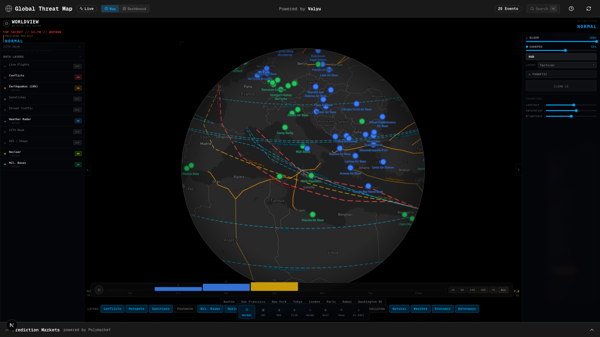

# Global Threat & Event Intelligence Map

A real-time global situational awareness platform that plots security events, geopolitical developments, and threat indicators on an interactive map. Think of it as an OSINT (Open Source Intelligence) command center.



## Features

### Core Features

- **Real-Time Event Mapping** - Plot breaking news events (conflicts, protests, natural disasters) on a world map with color-coded threat levels
- **Interactive Mapbox Map** - Dark-themed map with clustering, heatmap visualization, and smooth navigation
- **Event Feed** - Real-time filterable feed of global events with category and threat level filters
- **Intel Dossiers** - Build intelligence dossiers on any actor with deep research reports, CSV data exports, and PowerPoint briefings
- **Alert System** - Configure keyword and region-based alerts with real-time notifications

### Country Intelligence

Click on any country to view detailed conflict intelligence:

- **Historical Conflicts** - Wars, military engagements, and conflicts throughout history with dates, opposing parties, and outcomes
- **Current Conflicts** - Ongoing wars, military tensions, border disputes, civil unrest, terrorism threats, and geopolitical tensions
- **Tabbed Interface** - Current conflicts (red-themed) and Historical conflicts (blue-themed) displayed in separate tabs
- **Country Highlighting** - Selected country fills with red color and blinks while loading data
- **AI-Powered Analysis** - Conflict data synthesized using Valyu Answer API with cited sources

### Military Bases Layer

Visualize global military presence:

- **US Military Bases** - Displayed as green markers (30+ bases worldwide)
- **NATO Installations** - Displayed as blue markers
- **Base Details** - Click any base to see its name, type, and host country
- **Automatic Loading** - Military base data loads when the map initializes
- **Coverage** - Includes bases in Europe, Asia-Pacific, Middle East, Africa, and the Americas

### BitChat Decentralized Comms

Built-in encrypted chat powered by the Nostr protocol and BitChat geohash channels:

- **Location-Based Channels** - Chat rooms automatically tied to your map viewport via geohashing — pan the map to switch regions
- **284 Geo-Distributed Relays** - Connects to the [permissionlesstech/georelays](https://github.com/permissionlesstech/georelays) directory, using Haversine distance to find the closest relays to your location
- **No Account Required** - Auto-generated cryptographic keypair stored locally, with export/import support
- **Encrypted DMs** - NIP-04 encrypted direct messages between users
- **23 Pre-Seeded Rooms** - Global coverage from US East Coast to Australia, with live activity indicators
- **BitChat Protocol Compatible** - Uses kind 20000 (ephemeral geohash), kind 23333 (standard channel), and kind 1 events — fully interoperable with [bitchat.land](https://bitchat.land)
- **Relay Management** - Add/remove relays, view connection status, supports `.onion` addresses for Tor

### Submarine Cables & Pipelines

Real-time infrastructure intelligence layer:

- **30 Major Submarine Cables** - Visualize the global undersea fiber optic network connecting continents
- **Cable Status Indicators** - Color-coded by operational status: cyan (active), red (damaged), yellow (degraded), gray (decommissioned)
- **25 Major Pipelines** - Oil and gas pipeline routes with status coloring (active, damaged, planned)
- **Click-to-Inspect** - Click any cable or pipeline for detailed popup with capacity, length, owners, landing points, and status badge
- **Real-World Status** - FLAG Europe-Asia and AAE-1 marked as damaged (Red Sea cuts 2024), SEA-ME-WE 3 as degraded, TAT-14 as decommissioned

### Command Palette (Cmd+K)

Global search across the entire platform:

- **Keyboard Shortcut** - Press `Cmd+K` (Mac) or `Ctrl+K` (Windows) to open
- **Search Everything** - Events, news, 20 strategic cities, 17 map layers, military bases
- **Keyboard Navigation** - Arrow keys, Enter to select, Esc to close
- **Grouped Results** - Results organized by category for quick scanning

### 7-Day Timeline Bar

Event density visualization across time:

- **Event Density Bars** - Visual histogram of event distribution over the past 7 days
- **Severity Coloring** - Bars colored by dominant threat level
- **Time Presets** - Quick filter: 1H, 6H, 24H, 48H, 7D, ALL
- **Auto-Pan Integration** - Play/pause to pan across the globe automatically

### Country Instability Index (CII)

Strategic risk dashboard:

- **22 Countries Monitored** - Including Ukraine, Israel/Gaza, Taiwan Strait, Red Sea, DRC, Ethiopia, Somalia, and more
- **Ring Score Visualization** - SVG circular progress indicator per country (0-100 scale)
- **Trend Indicators** - Comparing 24h vs previous 24h: worsening (▲), improving (▼), stable (►)
- **World Heatmap** - Geographic dot display showing country positions

### CCTV Mesh

Live traffic camera feeds from around the world:

- **25+ Camera Feeds** - London, Singapore, Los Angeles, Hong Kong, New York, Sydney, Dubai
- **Server-Side Proxy** - Government camera feeds proxied through `/api/cctv` to avoid CORS
- **Auto-Refresh** - Camera images update every 30 seconds

### Map Visualization

- **Auto-Pan Mode** - Play/pause button to automatically pan across the globe
- **Event Clustering** - Group nearby events for cleaner visualization at lower zoom levels
- **Heatmap View** - Toggle heatmap to visualize event density
- **Entity Locations** - When researching entities, their known locations appear as purple markers on the map
- **Live Flights** - Real-time aircraft positions from OpenSky Network
- **Satellite Tracking** - ISS and major satellite positions via N2YO
- **AIS / Ships** - Live vessel tracking via AISStream
- **Weather Radar** - Mapbox weather overlay layer
- **Nuclear Sites** - Global nuclear facility locations

## Tech Stack

- **Framework**: Next.js 16 (App Router)
- **Map**: Mapbox GL JS + react-map-gl
- **UI**: Tailwind CSS v4 + custom components
- **Intelligence API**: valyu-js (search, answer, deep research)
- **Decentralized Chat**: nostr-tools (Nostr protocol / BitChat)
- **Schema Validation**: zod
- **State Management**: Zustand
- **Markdown**: react-markdown + remark-gfm

## Getting Started

### Prerequisites

- Node.js 18+
- Mapbox account and API token
- Valyu API key

### Installation

1. Clone the repository and install dependencies:

```bash
npm install
```

2. Create a `.env.local` file in the root directory:

```env
NEXT_PUBLIC_MAPBOX_TOKEN=your_mapbox_token_here
VALYU_API_KEY=your_valyu_api_key_here
NEXT_PUBLIC_APP_MODE=self-hosted

# Optional: Enable AI-powered location extraction for better accuracy
OPENAI_API_KEY=your_openai_api_key_here
```

3. Get your API keys:
   - **Mapbox**: [Get a token](https://account.mapbox.com/access-tokens/)
   - **Valyu**: [Get an API key](https://valyu.ai)
   - **OpenAI** (optional): [Get an API key](https://platform.openai.com/api-keys) - enables AI-powered location extraction

4. Run the development server:

```bash
npm run dev
```

5. Open [http://localhost:3000](http://localhost:3000) in your browser.

## Project Structure

```
globalthreatmap/
├── app/
│   ├── layout.tsx              # Root layout
│   ├── page.tsx                # Main dashboard
│   ├── globals.css             # Global styles
│   └── api/                    # API routes
│       ├── events/             # Event fetching via Valyu
│       ├── entities/           # Entity research
│       ├── reports/            # Deep research reports
│       ├── countries/
│       │   └── conflicts/      # Country conflict intelligence
│       └── military-bases/     # Military base data
├── components/
│   ├── map/                    # Map components
│   │   ├── threat-map.tsx      # Main map component
│   │   ├── timeline-scrubber.tsx # Auto-pan controls
│   │   └── country-conflicts-modal.tsx # Conflict details modal
│   ├── chat/                   # BitChat/Nostr chat components
│   │   ├── chat-panel.tsx      # Main chat container
│   │   ├── channel-header.tsx  # Region name, room selector
│   │   ├── chat-message.tsx    # Message bubbles
│   │   ├── chat-input.tsx      # Message input
│   │   ├── dm-panel.tsx        # Encrypted DMs
│   │   └── relay-status.tsx    # Relay config & identity
│   ├── feed/                   # Event feed components
│   ├── search/                 # Entity search components
│   ├── alerts/                 # Alert management
│   └── ui/                     # Base UI components
│       └── markdown.tsx        # Markdown renderer
├── lib/
│   ├── valyu.ts                # Valyu client & API functions
│   ├── nostr.ts                # Nostr protocol client (keys, pool, subs)
│   ├── georelays.ts            # Geo-distributed relay directory
│   ├── geohash.ts              # Geohash encoding/decoding
│   ├── geocoding.ts            # Location extraction
│   └── event-classifier.ts     # Event classification
├── stores/
│   ├── map-store.ts            # Map state (viewport, layers, bases)
│   └── nostr-store.ts          # Chat state (messages, relays, DMs)
├── types/                      # TypeScript types
└── hooks/                      # React hooks
```

## Usage

### Interactive Map

- **Click on a Country** - Opens the Country Conflicts Modal showing historical and current conflicts
- **Click on an Event Marker** - Shows event details popup
- **Click on a Military Base** - Shows base name, type (US/NATO), and country
- **Zoom/Pan** - Navigate the map or use auto-pan mode

### Event Feed

The event feed displays real-time global events. You can:
- Filter by threat level (Critical, High, Medium, Low, Info)
- Filter by category (Conflict, Protest, Disaster, Diplomatic, etc.)
- Search events by keyword
- Click on events to fly to their location on the map

### BitChat Comms

Click the **Comms** tab in the sidebar to access decentralized chat:

- **Chat** - Send and receive messages in the current geohash channel (auto-switches as you pan the map)
- **Rooms** - Click the channel header to browse 23 pre-seeded global rooms with live activity indicators
- **Private** - Send NIP-04 encrypted direct messages by entering a recipient's public key
- **Settings** - View/copy your public key, export/import your private key, manage relay connections

No signup needed — a cryptographic identity is generated automatically on first visit.

### Auto-Pan Mode

The play/pause button in the bottom-left corner toggles automatic map panning:
- **Play** - Map continuously pans eastward across the globe
- **Pause** - Stops the auto-pan animation

### Intel Dossiers (Deep Research)

Build comprehensive intelligence dossiers on any actor using Valyu's Deep Research API. Enter any entity - nations, militias, PMCs, cartels, political figures - and receive:

- **~50 Page Intelligence Report** - Extensively sourced analysis covering background, organizational structure, key figures, geographic presence, recent activities, threat assessment, and timeline of events
- **CSV Data Export** - Structured data with locations, coordinates, key figures, related organizations, significant events with dates, and source URLs - ready for further analysis
- **PowerPoint Briefing** - 8-slide executive intelligence briefing for presentations
- **PDF Report** - Downloadable full report

Reports take 5-10 minutes to generate but are extremely detailed and comprehensive, pulling from hundreds of sources across the web, academic papers, and proprietary databases. Perfect for OSINT analysts, researchers, and intelligence professionals who need exportable deliverables for briefings and further analysis.

### Country Conflicts

Click any country on the map to view:
- **Current Tab** (Red) - Active conflicts, military tensions, and ongoing security threats
- **Historical Tab** (Blue) - Past wars and military engagements with dates and outcomes
- **Sources** - Cited references for all conflict information (Wikipedia excluded)

### Alerts

Create alert rules based on:
- Keywords (e.g., "nuclear", "sanctions")
- Threat levels
- Geographic regions (coming soon)

## API Routes

| Route | Method | Description |
|-------|--------|-------------|
| `/api/events` | GET | Fetch global events from Valyu |
| `/api/events` | POST | Fetch events with custom queries |
| `/api/entities` | GET/POST | Research entities and get locations |
| `/api/deepresearch` | POST | Create async deep research task with deliverables |
| `/api/deepresearch/[taskId]` | GET | Poll deep research task status and results |
| `/api/reports` | POST | Generate deep research reports |
| `/api/countries/conflicts` | GET | Get historical and current conflicts for a country |
| `/api/military-bases` | GET | Get US and NATO military base locations (1hr cache) |

## Valyu Integration

This app uses [Valyu](https://valyu.ai) for intelligence data:

- **Search API** - Finding global events and news
- **Answer API** - Synthesizing conflict intelligence and military base data
- **Deep Research** - Comprehensive entity analysis

Wikipedia is excluded from search results.

## Authentication

Global Threat Map supports two app modes controlled by the `NEXT_PUBLIC_APP_MODE` environment variable.

### App Modes

| Mode | Description |
|------|-------------|
| `self-hosted` | Default mode. No authentication required. All features are freely accessible. |
| `valyu` | OAuth mode. Users sign in with Valyu to access additional features. |

### Self-Hosted Mode (Default)

In self-hosted mode, the app runs entirely with your own Valyu API key:

```env
NEXT_PUBLIC_APP_MODE=self-hosted
VALYU_API_KEY=your_valyu_api_key_here
```

- No sign-in panel is displayed
- All features are available to all users
- API usage is billed to your Valyu account

### Valyu OAuth Mode

In valyu mode, users authenticate with their Valyu accounts:

```env
NEXT_PUBLIC_APP_MODE=valyu

# OAuth Configuration (contact contact@valyu.ai for credentials)
NEXT_PUBLIC_VALYU_AUTH_URL=https://auth.valyu.ai
NEXT_PUBLIC_VALYU_CLIENT_ID=your-client-id
VALYU_CLIENT_SECRET=your-client-secret
VALYU_APP_URL=https://platform.valyu.ai
NEXT_PUBLIC_REDIRECT_URI=http://localhost:3000/auth/valyu/callback
```

### Feature Gating (Valyu Mode)

When running in valyu mode, certain features require authentication:

| Feature | Unauthenticated | Authenticated |
|---------|-----------------|---------------|
| View map & events | ✅ Free | ✅ Free |
| Event feed | ✅ Free | ✅ Free |
| Country conflicts | ✅ 2 free lookups | ✅ Unlimited |
| Entity search | ❌ Blocked | ✅ Unlimited |
| Military bases | ✅ Free | ✅ Free |

After users exhaust their free usage, a sign-in modal prompts them to authenticate.

### OAuth Flow

The authentication uses OAuth 2.0 with PKCE (Proof Key for Code Exchange):

1. User clicks "Sign in with Valyu"
2. App generates PKCE code verifier and challenge
3. User is redirected to Valyu's authorization page
4. After authentication, Valyu redirects back to `/auth/valyu/callback`
5. App exchanges authorization code for access token
6. User info is stored in localStorage

### Project Structure (Auth)

```
globalthreatmap/
├── app/
│   ├── api/oauth/token/       # Token exchange endpoint
│   └── auth/valyu/callback/   # OAuth callback page
├── components/auth/
│   ├── sign-in-panel.tsx      # Floating auth panel
│   └── sign-in-modal.tsx      # Sign-in dialog
├── stores/
│   └── auth-store.ts          # Auth state management
└── lib/
    └── oauth.ts               # PKCE utilities
```
